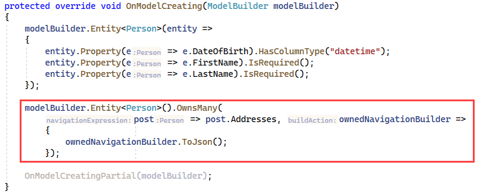

# Json Columns OwnsMany


```csharp
public partial class Person
{
    public int Id { get; set; }

    public string FirstName { get; set; }

    public string LastName { get; set; }

    public DateTime DateOfBirth { get; set; }
    public List<Address> Addresses { get; set; }
    public override string ToString() => $"{FirstName} {LastName}";
}
```

</br>

```csharp
public class Address
{
    public string Company { get; set; }
    public string Street { get; set; }
    public string City { get; set; }
    public override string ToString() => Company;
}
```

</br>



Contents for Adddress property.

```json
[
  {
    "City": "Wyndmoor",
    "Company": "Company1",
    "Street": "123 Apple St"
  },
  {
    "City": "Portland",
    "Company": "Company2",
    "Street": "999 34th St"
  }
]
```

# See also

- Microsoft docs [JSON Columns](https://devblogs.microsoft.com/dotnet/announcing-ef7-release-candidate-2/)
- [EF Core 7 code sample](https://github.com/karenpayneoregon/ef-core-7-samples) (Karen Payne)