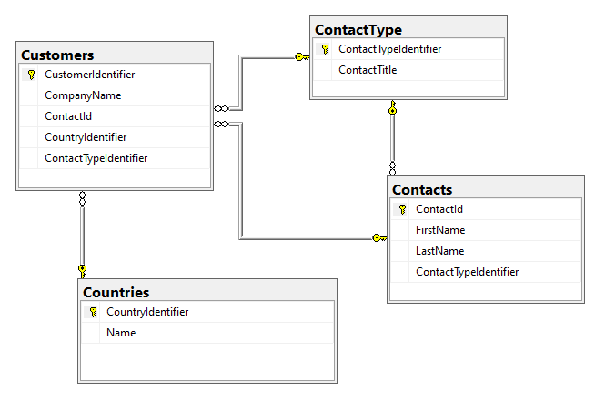

# EF Core: How to order by a Navigation property dynamically

In this article, learn how to perform order by using Entity Framework Core where order by are dynamic on navigation properties.

Our model will be a slimmed down version of NorthWind2022 used in [NorthWind2022Library](https://github.com/karenpayneoregon/ef-core-6-tips/tree/master/NorthWind2022Library) class project




Typically an order by is done using code similar to this

```csharp
using var context = new NorthWindContext();
var customers = context.Customers
    .Include(c => c.Contact)
    .Include(c => c.ContactTypeNavigation)
    .OrderBy(c => c.ContactTypeNavigation.ContactTitle)
    .ToList();
```
But suppose a requirement is to allow dynamic ordering, so instead of ordering by ContactTitle the requirement is to order by a contact first or last name or their country. 

One option is shown below 

Setup an `enum` for direction of the ordering

```csharp
public enum Direction
{
    /// <summary>
    /// Sort ascending.
    /// </summary>
    Ascending,
    /// <summary>
    /// Sort descending.
    /// </summary>
    Descending
}
```

Followed by a method which accepts a property name.

```csharp
public static IQueryable<Customers> OrderByString(this IQueryable<Customers> query, string key, Direction direction = Direction.Ascending)
{
    Expression<Func<Customers, object>> exp = key switch
    {
        "LastName" => customer => customer.Contact.LastName,
        "FirstName" => customer => customer.Contact.FirstName,
        "CountryName" => customer => customer.CountryNavigation.Name,
        "Title" => customer => customer.ContactTypeNavigation.ContactTitle,
        _ => customer => customer.CompanyName
    };

    return direction == Direction.Ascending ? query.OrderBy(exp) : query.OrderByDescending(exp);
}
```

Usage

```csharp
public static async Task<List<Customers>> SortByPropertySecondAttempt(string propertyName)
{
    await using var context = new NorthWindContext();
    return await context.Customers
        .Include(c => c.CountryNavigation)
        .OrderByString(propertyName, Direction.Ascending)
        .ToListAsync();
}
```


Although this works, if a key changes or not typed in properly the method will default to the default order, `CompanyName`

A better option, rather than passing the key as a string, use a `enum`

```csharp
public enum PropertyAlias
{
    FirstName,
    LastName,
    CountryName,
    Title
}
```

Now the key is a enum which means no mistakes as with a string shown above.

```csharp
public static IQueryable<Customers> OrderByEnum(this IQueryable<Customers> query, PropertyAlias key, Direction direction = Direction.Ascending)
{
    Expression<Func<Customers, object>> exp = key switch
    {
        PropertyAlias.LastName => customer => customer.Contact.LastName,
        PropertyAlias.FirstName => customer => customer.Contact.FirstName,
        PropertyAlias.CountryName => customer => customer.CountryNavigation.Name,
        PropertyAlias.Title => customer => customer.ContactTypeNavigation.ContactTitle,
        _ => customer => customer.CompanyName
    };

    return direction == Direction.Ascending ? query.OrderBy(exp) : query.OrderByDescending(exp);
}
```

Usage

```csharp
await using var context = new NorthWindContext();
List<Customers> customers = await context.Customers
    .Include(c => c.CountryNavigation)
    .OrderByEnum(PropertyAlias.CountryName, Direction.Ascending)
    .ToListAsync();
```

That covers dynamic ordering of navigations, for top level ordering consider the following method which requires the property name as a string.

```csharp
public static List<T> OrderByPropertyName<T>(this List<T> list, string propertyName, Direction sortDirection)
{

    ParameterExpression param = Expression.Parameter(typeof(T), "item");

    Expression<Func<T, object>> sortExpression = 
        Expression.Lambda<Func<T, object>>(Expression.Convert(Expression.Property(param, propertyName), typeof(object)), param);

    list = sortDirection switch
    {
        Direction.Ascending => list.AsQueryable().OrderBy(sortExpression).ToList(),
        _ => list.AsQueryable().OrderByDescending(sortExpression).ToList()
    };

    return list;

}
```

Since the method calls for the property name as a string, here is a method to get model names for a DbContext which in turn allows us to get property names in the second code block.

```csharp
public static List<string> GetDatabaseModels()
{
    using var context = new NorthWindContext();

    return context.GetModelNames().Select(type => type.Name).ToList();
}
```

Code to get property names for a model.

```csharp
public static List<SqlColumn> GetModelProperties(this DbContext context, string modelName)
{

    if (context == null) throw new ArgumentNullException(nameof(context));

    var entityType = GetEntityType(context, modelName);

    var list = new List<SqlColumn>();

    IEnumerable<IProperty> properties = context.Model
        .FindEntityType(entityType ?? throw new InvalidOperationException())!
        .GetProperties();

    foreach (IProperty itemProperty in properties)
    {
        SqlColumn sqlColumn = new SqlColumn
        {
            Name = itemProperty.Name,
            IsPrimaryKey = itemProperty.IsKey(),
            IsForeignKey = itemProperty.IsForeignKey(),
            IsNullable = itemProperty.IsColumnNullable()
        };


        list.Add(sqlColumn);

    }

    return list;

}
```

</br>

```csharp
public class SqlColumn
{
    public bool IsPrimaryKey { get; set; }
    public bool IsForeignKey { get; set; }
    public bool IsNullable { get; set; }
    /// <summary>
    /// Column/property name
    /// </summary>
    public string Name { get; set; }
    /// <summary>
    /// Description/comment from table definition in database table
    /// </summary>
    public string Description { get; set; }
    public override string ToString() => Name;

}
```


## Code samples

- SortCustomerOnCountryName, sort on included table for countries
- SortCustomerOnContactLastName, sort on included table for contacts

# Helper methods

| Method        |   Description    |
|:------------- |:-------------|
| [GetDatabaseModels](https://github.com/karenpayneoregon/ef-core-6-tips/blob/master/SortByColumnNameApp/Classes/GetOperations.cs#L13) | Get model names for a DbContext
| [GetProperties](https://github.com/karenpayneoregon/ef-core-6-tips/blob/master/SortByColumnNameApp/Classes/GetOperations.cs#L20) | Get properties for a model
| [OrderByString](https://github.com/karenpayneoregon/ef-core-6-tips/blob/master/SortByColumnNameApp/Classes/OrderingHelpers.cs#L38) | Order a navigation property using a string for the property to order by
| [OrderByEnum](https://github.com/karenpayneoregon/ef-core-6-tips/blob/master/SortByColumnNameApp/Classes/OrderingHelpers.cs#L60) | Order a navigation propery using an enum for the property to order by
| [OrderByPropertyName](https://github.com/karenpayneoregon/ef-core-6-tips/blob/master/SortByColumnNameApp/Classes/OrderingHelpers.cs#L103) | Order top level property by string


## See also

[How to display an enum in WinForms ComboBox or ASP.NET Core Select](https://github.com/karenpayneoregon/display-enum-asp-winforms)


# Summary

Code has been provided to perform dynamic ordering of navigation and top level properties in EF Core queries which are both loosely and strong typed which suit most needs, if a more generic method is needed that becomes a tad more complex and think that what has been presented is the way to go especially those developers that do not have experience with [reflection](https://learn.microsoft.com/en-us/dotnet/csharp/programming-guide/concepts/reflection) and working with [Expression](https://learn.microsoft.com/en-us/dotnet/csharp/programming-guide/concepts/expression-trees/). 
